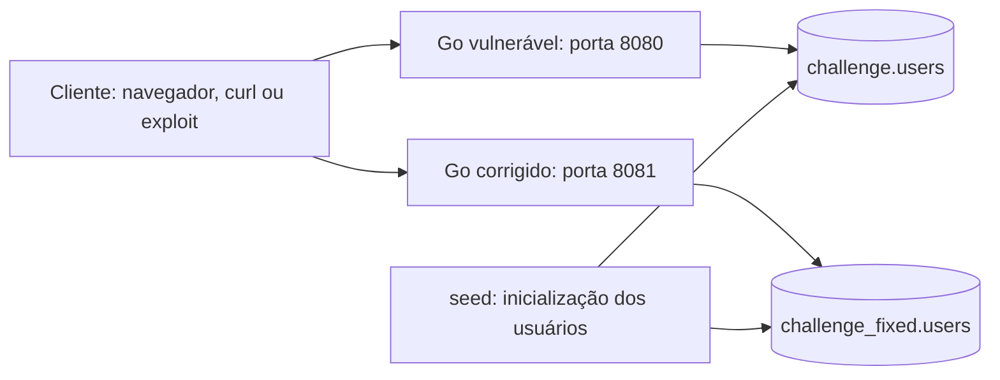

# Desafio 2 — Injeção NoSQL e extração de campos desconhecidos

> Trabalho de Cibersegurança: análise da vulnerabilidade, reprodução local, exploração automatizada e comparação com uma implementação corrigida.

Este projeto demonstra como uma falha no login permite descobrir informações internas de um banco MongoDB, recuperar um token de redefinição de senha e acessar a conta de outro usuário. O ponto central é entender **como uma entrada que deveria representar apenas credenciais passa a controlar a consulta ao banco**.

O trabalho parte do laboratório **“Exploiting NoSQL operator injection to extract unknown fields”**, da PortSwigger Web Security Academy. Além de reproduzir a exploração, o repositório entrega uma aplicação em **Go + MongoDB**, um **exploit em Python** e uma segunda versão do login que bloqueia os operadores injetados. Assim, é possível estudar a causa, executar o ataque e observar o efeito da correção no mesmo ambiente.

**[Abrir os slides da apresentação no Canva](https://canva.link/9sj5huqb3rm1dfa)** · **[Abrir o desafio e a solução oficial](https://portswigger.net/web-security/nosql-injection/lab-nosql-injection-extract-unknown-fields)**

> **Uso autorizado somente.** Os exemplos de exploração servem exclusivamente ao laboratório PortSwigger e à reimplementação local deste repositório. Não os utilize contra sistemas sem autorização explícita.

## Sumário

- [1. Visão geral e objetivo](#1-visão-geral-e-objetivo)
- [2. O que foi feito de diferente da solução oficial](#2-o-que-foi-feito-de-diferente-da-solução-oficial)
- [3. Organização do repositório](#3-organização-do-repositório)
- [4. Arquitetura e funcionamento](#4-arquitetura-e-funcionamento)
- [5. Entendendo a vulnerabilidade](#5-entendendo-a-vulnerabilidade)
- [6. Como o exploit funciona](#6-como-o-exploit-funciona)
- [7. Como a correção funciona](#7-como-a-correção-funciona)
- [8. Como executar e reproduzir](#8-como-executar-e-reproduzir)
- [9. Verificações manuais e resultados esperados](#9-verificações-manuais-e-resultados-esperados)
- [10. Evidências e limites da validação](#10-evidências-e-limites-da-validação)
- [11. Decisões, dificuldades e limitações](#11-decisões-dificuldades-e-limitações)
- [12. Material complementar e referências](#12-material-complementar-e-referências)

## 1. Visão geral e objetivo

| Item | Descrição |
|---|---|
| Tema | Segurança de aplicações web e bancos NoSQL |
| Vulnerabilidade | Injeção de operadores MongoDB no documento de consulta |
| Objetivo do desafio | Redefinir a senha e autenticar-se como `carlos` |
| Informação a descobrir | Nome do campo de recuperação e valor do token armazenado nele |
| Técnica | Extração cega por respostas booleanas, usando `$where` e expressões regulares |
| Aplicação local | Go, `net/http`, `html/template` e MongoDB Go Driver v2 |
| Banco | MongoDB 7, conforme o Compose |
| Automação | Python 3.10+ e `requests` |
| Ambiente vulnerável | `http://localhost:8080` → banco `challenge` |
| Ambiente corrigido | `http://localhost:8081` → banco `challenge_fixed` |

O objetivo oficial é entrar na conta de `carlos`, recuperando primeiro seu token de redefinição. A conclusão é demonstrada pelo acesso à conta; o projeto não depende de uma flag textual. A descrição e o procedimento de referência estão na [página oficial do laboratório](https://portswigger.net/web-security/nosql-injection/lab-nosql-injection-extract-unknown-fields).

Na reprodução local, `wiener` / `peter` permite verificar o login legítimo. A senha inicial de `carlos` é aleatória. O exploit não recebe essa senha nem consulta diretamente o banco: ele reconstrói o token pelas respostas HTTP e usa o fluxo de recuperação para definir outra senha.

## 2. O que foi feito de diferente da solução oficial

**A contribuição do trabalho está na implementação, na automação e na comparação entre ataque e defesa.** A técnica de exploração parte da solução publicada pela PortSwigger; a descoberta da vulnerabilidade não é apresentada como uma técnica inédita.

| Aspecto | Referência oficial | Implementação deste trabalho |
|---|---|---|
| Ambiente | Laboratório hospedado | Reprodução local com código Go e MongoDB em containers |
| Verificação da injeção | Burp Repeater | Requisições Python e exemplos com `curl` |
| Extração de caracteres | Burp Intruder, modo Cluster bomb | Busca binária por conjuntos de caracteres |
| Execução das posições | Configuração de payloads no Intruder | Posições extraídas em paralelo com `ThreadPoolExecutor` |
| Descoberta do token | Identificação de campo e reconstrução do valor | Descoberta dinâmica, confirmação do campo e extração automatizadas |
| Recuperação e login | Conclusão pelo navegador | Leitura de formulário, preservação de cookies/CSRF, troca de senha e login pelo script |
| Estudo da defesa | Procedimento de exploração | Segundo servidor com validação e consulta controlada pela aplicação |

Comparação baseada na [solução oficial](https://portswigger.net/web-security/nosql-injection/lab-nosql-injection-extract-unknown-fields) e no [exploit implementado](exploit/exploit.py).

Os principais entregáveis próprios são:

1. **Aplicação reproduzível:** três binários (`server`, `fixed` e `seed`) construídos pela mesma imagem Docker.
2. **Comparação isolada:** bancos separados para que a alteração da senha no ambiente vulnerável não modifique os dados do corrigido.
3. **Exploit de ponta a ponta:** da confirmação de `$ne` ao login com a nova senha, com URL configurável.
4. **Extração otimizada:** descoberta do comprimento, divisão do alfabeto e concorrência entre posições.
5. **Correção implementada:** allowlist de chaves, decodificação para strings e construção explícita da consulta, além de schema na coleção corrigida.
6. **Registro de execução e análise:** documentação do ataque local, da defesa e de uma execução anterior no laboratório hospedado.

## 3. Organização do repositório

```text
cybersec-desafio2/
├── README.md                       # documentação principal
├── .gitignore                      # exclusão de artefatos locais
├── Dockerfile                      # compila server, fixed e seed
├── docker-compose.yml              # MongoDB, inicialização e servidores
├── go.mod / go.sum                 # versão Go e dependências
├── cmd/
│   ├── server/main.go              # inicia a aplicação vulnerável
│   ├── fixed/main.go               # inicia a aplicação corrigida
│   └── seed/main.go                # recria usuários nos dois bancos
├── internal/
│   ├── app/
│   │   ├── app.go                  # rotas, mensagens, cookies e CSRF
│   │   ├── vuln.go                 # JSON recebido usado como filtro
│   │   ├── fixed.go                # validação e consulta controlada
│   │   ├── forgot.go               # solicitação e conclusão do reset
│   │   └── templates.go            # páginas HTML
│   └── db/db.go                    # conexão e geração aleatória
├── exploit/
│   ├── exploit.py                 # exploração automatizada
│   └── requirements.txt           # dependência requests
├── tests/
│   ├── test_vuln.py               # confirma a vulnerabilidade em HTTP real
│   └── test_fixed.py              # confirma a mitigação e o login legítimo
└── documentacao/
    ├── README.md                   # visão geral anterior do laboratório
    ├── plan.md                     # planejamento e decisões históricas
    └── docs/
        ├── WRITEUP.md              # análise detalhada da exploração
        ├── PREVENTION.md           # discussão das defesas
        └── LAB_LIVE.md             # registro da execução hospedada
```

**Roteiro de leitura:** comece por este README; consulte [`vuln.go`](internal/app/vuln.go) para localizar a causa da falha, [`exploit.py`](exploit/exploit.py) para acompanhar sua exploração e [`fixed.go`](internal/app/fixed.go) para comparar a correção. Os arquivos de `documentacao/` aprofundam o processo de construção.

## 4. Arquitetura e funcionamento



Os dois bancos ficam na mesma instância MongoDB. Os servidores compartilham as páginas, as rotas e a recuperação de senha; a escolha entre `loginVuln` e `loginFixed` ocorre pelo campo `Server.Fixed`. A coleção usada também muda entre as versões.

O Compose aguarda o MongoDB responder ao healthcheck, executa o `seed` e inicia os servidores após a conclusão da inicialização. O serviço `fixed` só é incluído com o perfil `fixed`. O MongoDB usa volume persistente e não publica a porta 27017 no host.

### Rotas

| Método | Rota | Função |
|---|---|---|
| `GET` | `/` | Redireciona para `/login` |
| `GET` | `/login` | Exibe a página de autenticação |
| `POST` | `/login` | Recebe as credenciais em JSON; concentra a diferença entre as versões |
| `GET` | `/forgot-password` | Exibe a solicitação de recuperação |
| `GET` | `/forgot-password?passwordReset=<token>` | Valida o token e apresenta o formulário de nova senha |
| `POST` | `/forgot-password` | Solicita recuperação ou troca a senha, conforme os campos enviados |
| `GET` | `/my-account` | Exibe o usuário indicado pelo cookie de sessão didático |

**Não existe uma rota `/reset-password` na implementação atual.** A conclusão da troca ocorre em `POST /forgot-password`.

### Dados iniciais

O [`seed`](cmd/seed/main.go) insere os seguintes usuários em cada banco:

| Usuário | Senha | Estado inicial |
|---|---|---|
| `wiener` | `peter` | Sem token; login normal |
| `carlos` | Aleatória, gerada no seed | Com token; resposta de conta bloqueada quando a consulta encontra o documento |

No ambiente local, o campo se chama `passwordReset` e o token contém **16 caracteres hexadecimais**, gerados a partir de 8 bytes de `crypto/rand`. O seed preserva a ordem dos campos com `bson.D`; o exploit enumera os índices sem assumir que o token esteja em uma posição específica.

## 5. Entendendo a vulnerabilidade

### A causa: transformar entrada em estrutura de consulta

O login vulnerável decodifica o JSON para `bson.M` e o entrega diretamente ao MongoDB. O trecho central de [`vuln.go`](internal/app/vuln.go), omitindo o tratamento de erros, é:

```go
var filter bson.M
json.NewDecoder(r.Body).Decode(&filter)
s.Users.FindOne(r.Context(), filter).Decode(&user)
```

Uma requisição legítima fornece valores:

```json
{"username": "carlos", "password": "invalid"}
```

A requisição maliciosa fornece um operador no lugar da senha:

```json
{"username": "carlos", "password": {"$ne": "invalid"}}
```

`$ne` significa “diferente de”. A consulta passa a procurar `carlos` com uma senha diferente de `invalid`, em vez de exigir a senha correta. A estrutura do filtro ficou sob controle do cliente.

### O oráculo booleano

Um **oráculo booleano** é uma resposta observável que permite distinguir se determinada condição é verdadeira ou falsa. Aqui, o texto da página faz esse papel:

| Resultado da consulta | Mensagem local | Interpretação durante a extração |
|---|---|---|
| Não encontrou usuário | `Invalid username or password` | Condição falsa |
| Encontrou usuário com token pendente | `Account locked: please reset your password` | Condição verdadeira |

O operador `$where` acrescenta uma expressão JavaScript avaliada sobre o documento. Com a conta bloqueada, os valores `"0"` e `"1"` produzem respostas diferentes:

```json
{"username":"carlos","password":{"$ne":"invalid"},"$where":"0"}
```

```json
{"username":"carlos","password":{"$ne":"invalid"},"$where":"1"}
```

Essas respostas permitem substituir a condição constante por perguntas sobre os dados. Por exemplo:

```javascript
Object.keys(this)[1].match('^.{0}u.*')
```

A expressão pergunta se o primeiro caractere do nome do campo de índice 1 é `u`. Se a página responder `Account locked`, a condição casou. Repetindo perguntas, o cliente reconstrói uma informação que a aplicação não devolve diretamente.

Nesse contexto, **“cega” significa que a extração depende de sinais nas respostas**, e não de uma página que mostre o documento completo. A demonstração usa JavaScript no contexto da consulta ao MongoDB; não demonstra execução de comandos do sistema operacional.

## 6. Como o exploit funciona

O [`exploit.py`](exploit/exploit.py) executa sete etapas:

1. **Confirma a injeção:** compara credenciais inválidas, `$ne` e `$where` falso/verdadeiro.
2. **Solicita recuperação:** acessa `/forgot-password`, obtém o CSRF e solicita reset para `carlos`.
3. **Descobre os campos:** enumera `Object.keys(this)[i]` e extrai cada nome pelo oráculo.
4. **Identifica o campo do token:** testa os nomes como parâmetros de `/forgot-password`; `Invalid token` identifica o parâmetro reconhecido.
5. **Extrai o token:** aplica as perguntas ao valor de `this['<campo descoberto>']`.
6. **Redefine a senha:** lê o formulário, preserva token e CSRF e preenche a nova senha.
7. **Tenta o login:** envia `carlos` e a senha definida, acompanhando o redirecionamento.

O usuário-alvo `carlos` e as rotas são conhecidos pelo script; **o nome do campo do token e seu valor são descobertos dinamicamente**.

### Busca binária e paralelismo

O alfabeto padrão contém 63 caracteres: `a-z`, `A-Z`, `0-9` e `_`. Em vez de testar cada candidato individualmente, `_subset_matches()` pergunta se o caractere pertence a uma parte do alfabeto:

```javascript
this['passwordReset'].match('^.{3}[abcdefghijklm].*')
```

Se a condição for verdadeira, a busca continua naquele conjunto; caso contrário, continua no restante. Isso reduz sucessivamente os candidatos até sobrar um, que é confirmado por outra consulta.

| Estratégia | Custo de identificação por posição |
|---|---|
| Testar cada candidato separadamente | Até `A` consultas, para alfabeto de tamanho `A` |
| Dividir o conjunto de candidatos | Até `ceil(log2(A))` consultas de divisão + 1 confirmação |
| Alfabeto padrão, `A = 63` | Até 7 consultas por posição, sem contar retries |

Antes de extrair os caracteres, `string_length()` procura o comprimento por busca binária. As posições são então processadas em paralelo, com **32 workers por padrão** e uma `requests.Session` por thread. A concorrência busca reduzir o tempo de espera, sem diminuir por si só a quantidade de consultas.

Esses números descrevem o algoritmo implementado. **Não representam uma medição de aceleração ponta a ponta**: descoberta de campos, cálculo dos comprimentos, rede, retries e reset também têm custo.

### Funções para acompanhar no código

| Função | Responsabilidade |
|---|---|
| `confirm_vulnerability()` | Verifica as respostas que sustentam o ataque |
| `NoSQLOracle.oracle()` | Envia a condição e procura `Account locked` |
| `string_length()` / `extract_char_at()` | Descobrem comprimento e caracteres |
| `extract()` / `discover_fields()` | Coordenam a extração paralela e a enumeração |
| `find_token_field()` | Confirma qual nome corresponde ao token |
| `extract_form()` / `reset_password()` | Interpretam o formulário e concluem a troca |
| `login_as_carlos()` | Executa a tentativa final de autenticação |

## 7. Como a correção funciona

O [`loginFixed`](internal/app/fixed.go) restringe o que o cliente pode fornecer e monta sua própria consulta:

1. **Allowlist de chaves:** aceita apenas `username` e `password`; `$where` na raiz é rejeitado.
2. **Decodificação para strings:** um objeto como `{"$ne":"invalid"}` não pode ser usado como senha.
3. **Consulta explícita:** o banco recebe somente os dois valores convertidos para strings:

```go
filter := bson.M{"username": username, "password": password}
```

O [`seed`](cmd/seed/main.go) também cria a coleção corrigida com `$jsonSchema`, restringindo tipos e propriedades dos **documentos armazenados**. Esse schema complementa a validação, mas não valida os filtros de leitura nem substitui a correção do login.

| Entrada | Versão vulnerável, após seed | Versão corrigida |
|---|---|---|
| `wiener` / `peter` | Login permitido | Login permitido |
| `carlos` / `invalid` | Credenciais inválidas | Credenciais inválidas |
| Senha como objeto `$ne` | Conta encontrada; mensagem de bloqueio | Entrada rejeitada |
| `$where` no corpo | Expressão chega ao MongoDB | Chave rejeitada |
| Exploit completo | Pode extrair o token e redefinir a senha | Interrompe na confirmação de `$ne` |

As rejeições atuais renderizam uma página com a mensagem de erro e **HTTP 200**, não HTTP 400. O login bem-sucedido produz redirecionamento HTTP 302.

Desabilitar JavaScript no MongoDB é discutido no [documento de prevenção](documentacao/docs/PREVENTION.md), mas **não está aplicado no Compose**. Os servidores compartilham a instância MongoDB e o laboratório vulnerável depende de `$where`.

## 8. Como executar e reproduzir

Use os comandos a partir da raiz deste repositório. A reprodução foi preparada para o ambiente de estudo local.

### Pré-requisitos

- Docker com daemon acessível e Docker Compose v2 (`docker compose`).
- Python **3.10 ou superior**, `pip` e suporte a `venv`.
- Portas 8080 e 8081 disponíveis.
- Acesso à internet na primeira construção para baixar imagens e dependências.

Não é necessário instalar Go no host ao usar Docker. Para compilar fora do container, o [`go.mod`](go.mod) declara **Go 1.26**, também usado pelo Dockerfile.

### 1. Preparar o cliente Python

```bash
python3 -m venv .venv
source .venv/bin/activate
python -m pip install -r exploit/requirements.txt
```

### 2. Subir as duas versões

```bash
docker compose --profile fixed up --build -d
docker compose --profile fixed ps -a
docker compose logs seed
```

É esperado que `seed` termine com código 0. Ele é um inicializador, não um servidor permanente. `mongo`, `server` e `fixed` devem permanecer ativos.

- [Abrir aplicação vulnerável](http://localhost:8080/login)
- [Abrir aplicação corrigida](http://localhost:8081/login)

### 3. Executar os testes automatizados

Os testes fazem requisições HTTP reais aos dois servidores, sem mocks. Em Linux/macOS:

```bash
python tests/test_vuln.py --target http://localhost:8080
python tests/test_fixed.py --target http://localhost:8081
```

No PowerShell do Windows, use:

```powershell
py tests\test_vuln.py --target http://localhost:8080
py tests\test_fixed.py --target http://localhost:8081
```

Cada script imprime `[OK]` para as verificações aprovadas e termina com código `0` quando todas passam. `test_vuln.py` confirma que `$ne` e `$where` são processados no ambiente vulnerável. `test_fixed.py` confirma que esses payloads são recusados e que o login legítimo continua funcionando.

### 4. Executar o exploit contra a versão vulnerável

```bash
python exploit/exploit.py --target http://localhost:8080
```

Saída esperada, abreviada; o token muda a cada inicialização ou solicitação de reset:

```text
[+] Injecao confirmada: $ne e $where processados pelo MongoDB.
    campos descobertos: ['_id', 'username', 'password', 'email', 'passwordReset']
    campo do token: passwordReset
    token: <token extraído>
[+] SUCESSO: logado como carlos. URL final: http://localhost:8080/my-account
```

A senha definida por padrão é `Pwned1234!`. Para escolher outra e ajustar a concorrência:

```bash
python exploit/exploit.py --target http://localhost:8080 \
  --new-password 'SenhaDoLaboratorio123!' --workers 8 --debug
```

### 5. Repetir contra a versão corrigida

```bash
python exploit/exploit.py --target http://localhost:8081
```

Resultado esperado:

```text
AssertionError: $ne nao aceito (sem 'Account locked')
```

Nesse teste, a saída com erro é esperada: o script interrompe porque não consegue confirmar a injeção. As verificações manuais da seção seguinte também permitem conferir que o login legítimo continua funcionando.

### 6. Reinicializar ou encerrar

O ataque bem-sucedido remove o token e desbloqueia a conta local. Como o script confirma a injeção **antes** de solicitar outro reset, uma segunda execução pode falhar nessa etapa. Para repetir desde o início:

```bash
docker compose run --rm seed
```

**Esse comando apaga e recria os usuários nos dois bancos do laboratório**, substituindo as senhas e os tokens anteriores. Não execute o seed durante uma extração.

Para encerrar os serviços preservando o volume:

```bash
docker compose --profile fixed down
```

### Opções do exploit

| Opção | Padrão | Uso |
|---|---|---|
| `--target` | `http://localhost:8080` | URL base |
| `--new-password` | `Pwned1234!` | Senha definida após recuperar o token |
| `--workers` | `32` | Número de threads; use inteiro positivo |
| `--alphabet` | Letras, números e `_` | Caracteres candidatos para nomes e valores |
| `--debug` | Desativado | Exibe informações dos campos do formulário |

O mesmo script aceita a URL de uma instância autorizada do laboratório PortSwigger. O registro em `LAB_LIVE.md` contém uma instância histórica; sua disponibilidade atual não é garantida. Para uma nova reprodução hospedada, inicie sua própria instância na página oficial e use a URL fornecida em `--target`.

### Configuração dos servidores

| Variável | Padrão fora do Compose | Papel |
|---|---|---|
| `MONGO_URI` | `mongodb://localhost:27017` | Conexão com o MongoDB |
| `MONGO_DB` | `challenge` no servidor vulnerável; `challenge_fixed` no corrigido | Banco usado pelo servidor |
| `MONGO_DB_FIXED` | `challenge_fixed` | Segundo banco inicializado pelo seed |
| `ADDR` | `:8080` | Endereço de escuta do processo Go |

No Compose, a conexão usa `mongodb://mongo:27017`. Ambos os servidores escutam na porta 8080 dentro dos containers; o corrigido é publicado na porta **8081 do host**.

## 9. Verificações manuais e resultados esperados

Execute a comparação abaixo após o seed. As respostas são HTML; procure as mensagens indicadas.

**Baseline: senha incorreta na versão vulnerável.**

```bash
curl -s -H 'Content-Type: application/json' \
  -d '{"username":"carlos","password":"invalid"}' \
  http://localhost:8080/login
# Esperado: Invalid username or password
```

**Mesmo operador nas duas versões.**

```bash
curl -s -H 'Content-Type: application/json' \
  -d '{"username":"carlos","password":{"$ne":"invalid"}}' \
  http://localhost:8080/login
# Esperado: Account locked: please reset your password

curl -s -H 'Content-Type: application/json' \
  -d '{"username":"carlos","password":{"$ne":"invalid"}}' \
  http://localhost:8081/login
# Esperado: Invalid username or password
```

**Allowlist: chave extra no login corrigido, mesmo com credenciais válidas.**

```bash
curl -s -H 'Content-Type: application/json' \
  -d '{"username":"wiener","password":"peter","$where":"1"}' \
  http://localhost:8081/login
# Esperado: Invalid username or password
```

**Controle positivo: login legítimo no servidor corrigido.**

```bash
curl -s -o /dev/null -w '%{http_code}\n' \
  -H 'Content-Type: application/json' \
  -d '{"username":"wiener","password":"peter"}' \
  http://localhost:8081/login
# Esperado: 302
```

Para a apresentação, uma sequência útil é mostrar a baseline, executar o exploit vulnerável, explicar o filtro em `vuln.go`, comparar com `fixed.go` e finalizar com o ataque bloqueado e o login legítimo preservado.

### Problemas comuns

| Sintoma | Verificação ou ação |
|---|---|
| Conexão recusada em 8080/8081 | Consulte `docker compose --profile fixed ps -a` e `docker compose logs server fixed` |
| Servidores não iniciam | Confira `docker compose logs mongo seed`; a inicialização depende do seed |
| Porta 8081 indisponível | Inclua `--profile fixed` ao subir o ambiente |
| `$ne` falha em 8080 após um sucesso anterior | Reinicialize os dados com `docker compose run --rm seed` |
| Timeout ou extração incompleta | Reduza `--workers`, confira o alvo e evite outro reset durante a extração |
| `ModuleNotFoundError: requests` | Ative a `.venv` e instale `exploit/requirements.txt` |
| Build local exige outra versão de Go | Use a imagem Docker ou uma instalação compatível com `go.mod` |

## 10. Evidências e limites da validação

Os resultados anteriores estão registrados em `documentacao/`:

| Cenário | Resultado registrado | Fonte |
|---|---|---|
| Aplicação local vulnerável | Extração do token, troca de senha e login como `carlos` | [WRITEUP.md](documentacao/docs/WRITEUP.md) |
| Aplicação local corrigida | Rejeição de `$ne`; exploit interrompido | [PREVENTION.md](documentacao/docs/PREVENTION.md) |
| Login legítimo corrigido | Redirecionamento HTTP 302 | [PREVENTION.md](documentacao/docs/PREVENTION.md) |
| Laboratório hospedado | Login como `carlos` e banner `Solved` | [LAB_LIVE.md](documentacao/docs/LAB_LIVE.md) |

São **registros textuais de execuções anteriores**, não comprovação de que a instância hospedada continua disponível. Os tokens ali registrados são efêmeros e não devem ser copiados para uma nova execução.

Na revisão deste README, foram conferidos o código, as opções de `exploit.py --help` e a configuração com `docker compose --profile fixed config --quiet`. A execução completa não foi repetida: o ambiente de revisão não permitiu acesso ao socket Docker, e o Go instalado no host era 1.22.2, inferior ao 1.26 declarado pelo projeto. Portanto, as saídas das instruções acima estão identificadas como **esperadas**, com os resultados históricos atribuídos aos respectivos documentos.

O repositório contém dois testes funcionais automatizados: `tests/test_vuln.py`, que confirma a aceitação de `$ne` e a avaliação booleana de `$where` na versão vulnerável, e `tests/test_fixed.py`, que confirma o bloqueio desses payloads e preserva o login legítimo. Ambos exercitam os serviços reais via HTTP e exigem que o ambiente Docker Compose esteja em execução.

## 11. Decisões, dificuldades e limitações

### Adaptações da reprodução local

- **Campo conhecido no código, descoberto pelo exploit:** `passwordReset` é uma constante no servidor. Isso facilita reproduzir o cenário; o cliente de exploração continua descobrindo o nome por HTTP.
- **Estado inicial diferente do relato hospedado:** localmente, o seed já cria `carlos` com token. Solicitar recuperação substitui esse valor. O registro hospedado relata que o campo surgiu após a solicitação; essa observação não descreve o estado inicial local.
- **Bloqueio modelado pela presença do token:** no código local, token não vazio significa conta bloqueada. É uma decisão da reimplementação, sem acesso ao código interno do laboratório oficial.
- **E-mail simulado:** a aplicação mostra uma mensagem de envio, mas não implementa um serviço real de e-mail.
- **Schema na criação:** o seed aplica o validador ao criar a coleção corrigida. Se ela já existir, o código não executa `collMod` para atualizar seu schema.

### Dificuldades registradas durante a construção

O [planejamento](documentacao/plan.md) e o [writeup](documentacao/docs/WRITEUP.md) registram três ajustes relevantes:

1. **Inicialização Docker:** uso de `CMD` para permitir que `command` selecione `/app/server`, `/app/fixed` ou `/app/seed` na mesma imagem.
2. **Formulários HTML:** o parser passou a aceitar atributos com aspas duplas, simples ou sem aspas.
3. **Preservação do token:** o preenchimento verifica primeiro o nome do campo do token, evitando tratá-lo como campo de nova senha por conter a palavra `password`.

### Alcance da correção e do exploit

**“Corrigido” significa que o vetor de injeção estudado foi tratado no login.** A aplicação mantém simplificações que impedem considerá-la um sistema de autenticação pronto para produção:

- As senhas são armazenadas em texto simples.
- O cookie `session` contém diretamente o nome do usuário, e `/my-account` confia nesse valor. A página isolada não é uma prova robusta de autenticação.
- O fluxo de reset não implementa expiração temporal do token; não há limitação de tentativas.
- A extração considera até 20 campos e strings de até 80 caracteres. Caracteres fora do alfabeto e falhas de rede podem produzir resultados incompletos.
- Após esgotar retries de rede, `_oracle_retry()` retorna falso, confundindo indisponibilidade com condição negativa.
- A detecção final de sucesso do script verifica a ausência das mensagens de erro conhecidas; não exige explicitamente a identidade `carlos` no conteúdo. O banner `Solved` registrado para o alvo hospedado é uma evidência adicional.
- A decodificação para strings bloqueia objetos de operadores, mas não constitui validação completa de credenciais: por exemplo, `null` em Go pode deixar a string vazia sem erro.

Esses limites ajudam a interpretar o experimento: ele permite comparar a consulta vulnerável com a consulta controlada, mas não demonstra que todos os aspectos de segurança da aplicação foram resolvidos.

### Como ler a documentação anterior

Os arquivos em `documentacao/` preservam o histórico e incluem trechos de planejamento que não correspondem ao código final. Para executar a versão atual, considere os caminhos e comandos deste README. Em particular:

- O campo efetivo é `passwordReset`, com token local de 16 caracteres hexadecimais.
- O reset usa `/forgot-password`; não há `/reset-password`.
- A rejeição do login corrigido usa mensagem em HTTP 200, não HTTP 400.
- JavaScript no MongoDB continua habilitado no ambiente do laboratório.

## 12. Material complementar e referências

| Material | Para que consultar |
|---|---|
| [Slides da apresentação](https://canva.link/9sj5huqb3rm1dfa) | Material visual do trabalho |
| [Desafio e solução oficial — PortSwigger](https://portswigger.net/web-security/nosql-injection/lab-nosql-injection-extract-unknown-fields) | Enunciado e procedimento original usados na comparação |
| [Writeup detalhado](documentacao/docs/WRITEUP.md) | Payloads, raciocínio e etapas da exploração |
| [Prevenção](documentacao/docs/PREVENTION.md) | Discussão das camadas de defesa |
| [Execução hospedada](documentacao/docs/LAB_LIVE.md) | Registro textual do login e do banner `Solved` |
| [Planejamento e decisões](documentacao/plan.md) | Histórico de construção e ajustes |
| [README anterior do laboratório](documentacao/README.md) | Visão geral que serviu de referência interna |

O resultado do trabalho reúne **a explicação da causa, a reprodução do ataque, a automação da extração e a demonstração da correção**, com os limites de cada evidência explicitados.
